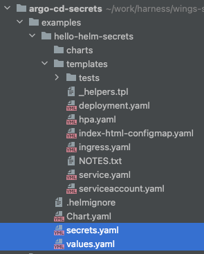
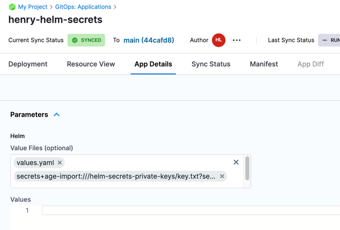

# jkroepke/helm-secrets

https://github.com/jkroepke/helm-secrets/wiki/ArgoCD-Integration

## Dependencies

- [SOPS releases](https://github.com/mozilla/sops/releases)
- [kubernetes releases](https://kubernetes.io/releases/)
- [helm-secrets releases](https://github.com/jkroepke/helm-secrets/releases)

# Build custom image

Run command: `./build-image.sh`

This will produce image `argocd-helm-secrets` locally.

# Using custom image

Need to change k8s to use the custom image and updating the configurations to use helm-secrets.

## Manually modify 

Update `argocd-repo-server`:
- Look for `kind: Deployment` for `argo-repo-server` manifest
- Update references from `quay.io/argoproj/argocd:latest` to `argocd-helm-secrets`
- Add `imagePullPolicy: Never` so it can pull the local image

Update `argocd-cm`:
```yaml
---
apiVersion: v1
kind: ConfigMap
metadata:
  ...
  name: argocd-cm
data:
  helm.valuesFileSchemes: >-
    secrets+gpg-import, secrets+gpg-import-kubernetes,
    secrets+age-import, secrets+age-import-kubernetes,
    secrets,
    https
```

## Script

Run command: `kubectl -n argocd apply -f argocd-mods.yml`

# Configuring argocd

## Create age key

Run command: `age-keygen -o key.txt`

Note: `key.txt` will contain the public key used to encrypt

## Add key to k8s

Run command: `kubectl create secret generic helm-secrets-private-keys --from-file=key.txt`

## Manually modify

```yaml
repoServer:
  volumes:
    - name: helm-secrets-private-keys
      secret:
        secretName: helm-secrets-private-keys

  volumeMounts:
    - mountPath: /helm-secrets-private-keys/
      name: helm-secrets-private-keys

```

## Script

Run command: `kubectl -n argocd apply -f argocd-repo-secret.yml`

# Encrypt data

Run command: `sops --encrypt --age [age-public-key] [input-file] > [output-file]`

Example: `sops --encrypt --age age123 test.yaml > test.enc.yaml`
 
# Using secrets in argocd

## your helm chart
When creating helm chart, put all your encrypted secrets in `secrets.yaml`.

For reference, `secrets.yaml` and `values.yaml` are at the same level.




## Creating app in gitops-ui

Create an app and add `values.yaml`.

After successfully adding `values.yaml`, go to the `App Details` screen and manually add the secrets.



Save changes, and sync.


